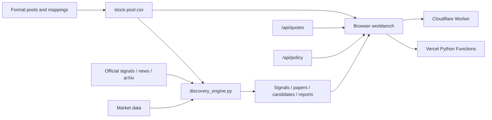

<div align="center">

# AI Industry-Chain Stock Pool

An investment-research workbench for US equities and A-share mappings, combining an industry graph, active discovery, arXiv signals, market position, and policy pressure.

[简体中文](README.md) · **English**

[](https://stocks.mastersgo.cc)
[](https://github.com/yaoleifly/ai-stock-pool/releases)
[](LICENSE)

[](https://vercel.com/new/clone?repository-url=https%3A%2F%2Fgithub.com%2Fyaoleifly%2Fai-stock-pool&project-name=ai-stock-pool&repository-name=ai-stock-pool)
[](https://deploy.workers.cloudflare.com/?url=https://github.com/yaoleifly/ai-stock-pool)

</div>

> [!IMPORTANT]
> This is a research and information-organization tool, not an automated trading system. Stock mappings, candidate scores, and policy-pressure signals are not investment advice.

## Why this project exists

A conventional watchlist can tell you which companies are present, but it rarely answers:

- Where does a company sit in the AI capital-expenditure chain?
- How do US themes map to A-share supply-chain and thematic exposure?
- Which directions have recently moved up the research queue based on official releases, news, and frontier papers?
- Has the market already priced in the fundamental signal?
- How much policy constraint is being created by rates, volatility, equities, inflation, and polling?

This project puts those questions into one inspectable data and UI model. It never updates the formal stock pool automatically; active discovery produces candidates that still require human verification.

## Core features

| Module | Capability | Primary input |
|---|---|---|
| Relationship graph | Upstream / midstream / downstream layout, themes, A-share mappings, zoom, and fullscreen | `stock-pool.csv` |
| Feature matrix | Compare names by chain position, theme, market, and status | `stock-pool.csv` |
| Stock list | Search, filters, quotes, and research positioning | Stock pool + `/api/quotes` |
| Active discovery | Joint scoring across official signals, news, arXiv, the current pool, and market position | Four discovery CSVs + reports |
| Policy and crowding | Six pressure drivers, EPS/revenue revisions, post-earnings attribution, delayed-cut timelines, and industry transmission | `/api/policy` + daily point-in-time snapshots |

Active discovery covers:

- official and industry signals;
- news and supply-chain developments;
- arXiv papers related to AI inference, storage, networking, robotics, advanced packaging, and adjacent themes;
- the current US / A-share pool and mapping layer;
- price changes and market position.

The policy-pressure index uses six weighted drivers: net approval 25%, S&P 500 20%, US 10-year yield 15%, MOVE 15%, VIX 15%, and CPI Nowcast 10%. A high score indicates stronger market and political constraints; it does not mean a policy will necessarily be withdrawn.

Institutional crowding is kept separate from policy pressure. It combines bullish-rating consensus, target-price optimism, concentrated target raises, and a price-versus-rating divergence where price weakens before analysts revise. A high target price alone is never treated as a top; the stronger distribution-risk label requires multiple confirming signals and real price divergence.

The contrarian module also records next-quarter EPS consensus changes versus 30 and 60 days ago. Revenue revisions are calculated from daily point-in-time snapshots and remain explicitly marked as collecting until enough history exists. One-, five-, and twenty-day post-earnings returns are compared with SOXX and paired with reaction-day volume to separate sector effects from company-specific weakness. Target-price events, the first 15% drawdown, and daily risk snapshots form the “price fell before analysts cut” timeline.

The policy page uses progressive disclosure. Its first reading layer keeps only the index, four pressure groups, current scenario, event stages, and one institutional-risk focus. A compact ranking controls the selected ticker, while full revisions, earnings windows, and the timeline expand on demand. Event evidence, six drivers, the decision matrix, trend history, industry transmission, and source health remain available in a secondary research layer without competing for first-screen attention.

The policy-event radar covers tariffs and trade, technology and export controls, military and geopolitical actions, and fiscal or industrial-subsidy policy. It classifies escalation, execution, softening or negotiation, and monitoring. News stages do not enter the pressure score directly; formal policy text and effective dates take priority.

## Architecture



The frontend does not require React, Vue, or a database. It reads static CSV / JSON snapshots and same-origin APIs, keeping deployment artifacts and research state easy to inspect.

## One-click deployment

### Provider comparison

| | Vercel | Cloudflare Workers |
|---|---|---|
| Static site | Native hosting | Workers Static Assets |
| `/api/health` | Python Function | Computed locally by the Worker |
| `/api/quotes` | Runs independently | Proxies a compatible upstream by default |
| `/api/policy` | Runs independently | Proxies upstream, then falls back to a snapshot |
| API key | Not required | Not required |
| Best for | Full self-hosting | Fast site and edge-entry replication |

### Vercel

[](https://vercel.com/new/clone?repository-url=https%3A%2F%2Fgithub.com%2Fyaoleifly%2Fai-stock-pool&project-name=ai-stock-pool&repository-name=ai-stock-pool)

Vercel clones the repository and deploys the static site together with `api/*.py`:

- `/api/health`: pool size and market distribution;
- `/api/quotes`: Yahoo Finance quote aggregation with a 60-second application cache;
- `/api/policy`: policy pressure, event stages, and institutional crowding with a 300-second application cache.

No secret or API key is required. After deployment, pushes to the cloned repository trigger future deployments.

### Cloudflare Workers

[](https://deploy.workers.cloudflare.com/?url=https://github.com/yaoleifly/ai-stock-pool)

Cloudflare runs `npm run build`, copies the UI, data snapshots, and reports into `dist/`, then deploys the Worker described by `wrangler.jsonc`.

Default behavior:

- `/api/health` is computed from the deployed `stock-pool.csv`;
- `/api/quotes` and `/api/policy` use `UPSTREAM_API_ORIGIN=https://stocks.mastersgo.cc`;
- if the policy upstream fails, the Worker falls back to `tpi-latest.json`;
- if the quote upstream fails, the API returns an explicit degraded state and never invents prices.

If you operate a compatible API, point `UPSTREAM_API_ORIGIN` to it. This is public configuration, not a secret.

## Local development

### Python server

Requires Python 3.11+:

```bash
git clone https://github.com/yaoleifly/ai-stock-pool.git
cd ai-stock-pool
python3 -m pip install -r requirements.txt
python3 server.py --port 8765
```

Open `http://127.0.0.1:8765`.

### Cloudflare Worker

Requires Node.js 20+:

```bash
npm install
npm run check
npx wrangler dev
```

Deploy to your Cloudflare account:

```bash
npx wrangler login
npm run deploy:cloudflare
```

## Refresh active-discovery data

```bash
python3 discovery_engine.py \
  --fresh \
  --days 7 \
  --max-arxiv-results 8 \
  --max-feed-items 15 \
  --max-extra-quotes 40 \
  --arxiv-delay 3
```

The command creates or updates:

- `discovery-signals.csv`
- `arxiv-papers.csv`
- `discovery-candidates.csv`
- `reports/discovery-YYYY-MM-DD.md`

Always run this guard before publishing:

```bash
npm run validate:data
```

If signals and candidates unexpectedly collapse to empty tables, stop the release. This usually indicates a network-fetch failure, not an absence of market signals.

## Merge your own stock pools

```bash
python3 sync_pool.py \
  --us-source /path/to/us-stock-pool.csv \
  --a-share-source /path/to/a-share-mapping.csv \
  --output stock-pool.csv
```

Without arguments, the script reads `美股股票池.csv` and `A股映射股票池.csv` from the parent directory.

The formal pool and the discovery layer are separate states. Discovery only emits research statuses such as `observe`, `already_in_pool`, and `reject`; it never promotes a candidate into the formal pool automatically.

## API reference

### `GET /api/health`

Returns the pool size, market distribution, cache duration, and policy endpoint.

### `GET /api/quotes`

Returns quotes, missing symbols, market counts, and the data timestamp. Add `?refresh=1` to request an application-cache bypass.

### `GET /api/policy`

Returns the policy-pressure score, four-part decomposition, six drivers, event stages, institutional crowding, EPS/revenue revisions, earnings-event windows, SOXX-adjusted returns, target-cut lag, daily history, the two-dimensional scenario matrix, industry mappings, source freshness, and error ledgers. Add `?refresh=1` to request a refetch.

The default crowding watchlist is `MU`, `NVDA`, `AMD`, `AVGO`, `MRVL`, and `SMCI`. This is contrarian risk monitoring, not top confirmation; earnings, orders, profits, and cash flow still require independent validation.

The hosted site's daily automation runs `crowding_snapshot.py` after active discovery. A snapshot is written only when all six names are present, preventing a transient network failure from corrupting the point-in-time series. Self-hosters can copy `examples/crowding-snapshot.yml` into `.github/workflows/` to enable GitHub Actions. Revenue 30- and 60-day changes become available only after enough history accumulates.

> Market and macro sources can be delayed, rate-limited, or temporarily unavailable. APIs report gaps or explicitly labeled fallback data.

## Data files

| File | Purpose | Generated by a script |
|---|---|---|
| `stock-pool.csv` | Formal deployment snapshot | Can be generated by `sync_pool.py` |
| `discovery-signals.csv` | Official and news signals | Yes |
| `arxiv-papers.csv` | arXiv paper signals | Yes |
| `discovery-candidates.csv` | Candidate scores and review state | Yes |
| `discovery-history.csv` | Daily discovery trend | Maintained after validation |
| `tpi-latest.json` | Policy-pressure fallback snapshot | Maintained from valid snapshots |
| `institutional-crowding-history.json` | Daily point-in-time risk, target, EPS, and revenue snapshots | `crowding_snapshot.py` |

## Repository layout

```text
api/                     Vercel Python Functions
cloudflare/              Cloudflare Worker and unit tests
reports/                 Active-discovery reports
scripts/                 Static build, integrity guard, Wrangler dry run
app.js                   UI state, data loading, and interactions
index.html               Page structure
styles.css               Visual system
discovery_engine.py      Active-discovery engine
policy_engine.py         Policy pressure, estimate revisions, earnings attribution, and delayed-cut calculation
crowding_snapshot.py     Daily institutional-consensus point-in-time snapshot
server.py                Local server and quote API
sync_pool.py             US / A-share source merge
vercel.json              Vercel configuration
wrangler.jsonc           Cloudflare Workers configuration
```

## Pre-release checks

```bash
npm run check
node --check app.js
PYTHONPYCACHEPREFIX=/tmp/ai-stock-pool-pycache \
  python3 -m py_compile \
  sync_pool.py discovery_engine.py policy_engine.py crowding_snapshot.py server.py \
  api/health.py api/quotes.py api/policy.py
```

`npm run check` validates non-empty data, runs Worker unit tests, builds static assets, and performs a Wrangler deployment dry run.

## FAQ

<details>
<summary>Why are quotes missing for some symbols?</summary>

Yahoo Finance may not cover a particular market symbol or may temporarily rate-limit requests. The UI keeps the stock in the pool, reports it in `missing`, and never creates a synthetic price.
</details>

<details>
<summary>Why can the arXiv paper count be zero?</summary>

Check the run warnings first. Timeouts, network restrictions, and upstream failures can all produce a zero result. It should not automatically be interpreted as “no relevant papers were published.”
</details>

<details>
<summary>Is the Cloudflare version fully independent?</summary>

The static site and health endpoint run independently. Quotes and policy use a replaceable compatible upstream by default. For a fully independent data backend, deploy the Vercel version first and point Cloudflare's `UPSTREAM_API_ORIGIN` to it.
</details>

<details>
<summary>Are candidates automatically added to the stock pool?</summary>

No. Active discovery creates a research queue and evidence trail. Formal inclusion requires human review.
</details>

## Security, data, and license

- The project does not require brokerage credentials, trading tokens, or a database password.
- `.env*`, `.dev.vars`, `.vercel/`, and `.wrangler/` are excluded from Git.
- Do not commit portfolio details, internal research, or paid-source content to a public fork.
- Report vulnerabilities privately through GitHub Security Advisories; see [SECURITY.en.md](SECURITY.en.md).
- Source code is released under the [MIT License](LICENSE).
- Market, news, paper, and policy data remain subject to their original providers' terms; see [NOTICE](NOTICE).

## Contributing

Issues and pull requests are welcome. Read [CONTRIBUTING.en.md](CONTRIBUTING.en.md) before contributing, and do not present thematic mappings as confirmed customer, supplier, or investment relationships.
