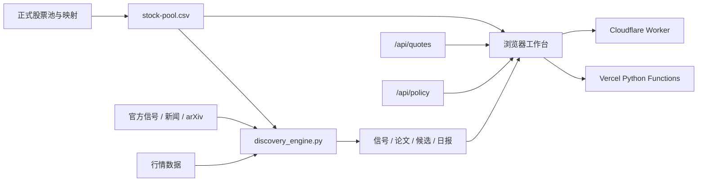

<div align="center">

# AI 产业链股票池

面向投资研究的美股 / A 股产业链工作台：关系图谱、主动发现、arXiv 信号、行情位置与政策压力。

**简体中文** · [English](README.en.md)

[](https://stocks.mastersgo.cc)
[](https://github.com/yaoleifly/ai-stock-pool/releases)
[](LICENSE)

[](https://vercel.com/new/clone?repository-url=https%3A%2F%2Fgithub.com%2Fyaoleifly%2Fai-stock-pool&project-name=ai-stock-pool&repository-name=ai-stock-pool)
[](https://deploy.workers.cloudflare.com/?url=https://github.com/yaoleifly/ai-stock-pool)

</div>

> [!IMPORTANT]
> 这是研究与信息组织工具，不是自动交易系统。股票池映射、候选评分和政策压力均不构成投资建议。

## 为什么做这个项目

传统股票列表只能回答“有哪些公司”，很难回答：

- 一家公司在 AI 资本开支链条中处于什么位置？
- 美股主线如何映射到 A 股供应链与主题资产？
- 新闻、官方发布和前沿论文，最近把哪些方向推到了研究优先级前列？
- 当前行情位置是否已经透支了基本面信号？
- 利率、波动率、股市、通胀与民调共同形成了多大的政策约束？

本项目把这些问题放进同一套可审计的数据和页面结构中。它不会自动改写正式股票池；主动发现只提出候选，最终仍需人工核实。

## 核心功能

| 模块 | 能力 | 主要输入 |
|---|---|---|
| 关系图谱 | 上游 / 中游 / 下游布局、主题关系、A 股映射、缩放与全屏 | `stock-pool.csv` |
| 特征矩阵 | 按产业位置、主题、市场和状态对比标的 | `stock-pool.csv` |
| 股票列表 | 搜索、筛选、行情与研究定位 | 股票池 + `/api/quotes` |
| 主动发现 | 官方信号、新闻、arXiv、股票池与行情位置联合评分 | 4 份 discovery CSV + 日报 |
| 政策与拥挤 | 六项政策压力、EPS/收入预期修正、财报归因、机构补降时间线和行业传导 | `/api/policy` + 每日时点快照 |

主动发现默认覆盖：

- 官方与产业信号；
- 新闻和产业链变化；
- arXiv 上与 AI 推理、存储、网络、机器人、先进封装等相关的论文；
- 当前股票池及美股 / A 股映射；
- 价格变化和行情位置。

政策压力指数采用六项指标：净支持率 25%、标普 500 20%、10 年期美债 15%、MOVE 15%、VIX 15%、CPI Nowcast 10%。高分表示市场与政治约束更强，不代表某项政策必然撤回。

机构拥挤度与政策压力是两套独立信号。拥挤度综合买入评级一致性、目标价乐观度、近期目标价上调集中度，以及“价格已经走弱但评级仍未松动”的背离。单一高目标价不会被判定为顶部；只有多项证据共振且价格出现背离，才会标记“派发风险”。

机构反向模块进一步记录下一季度 EPS 一致预期相对30日和60日前的变化；收入一致预期由每日时点快照计算，历史不足时明确显示“积累中”。最近财报后的1日、5日和20日收益会与 SOXX 对比，并结合反应日成交量区分行业因素和公司特异性走弱。目标价调整事件、15%回撤触发点和每日风险快照共同组成“股价先跌、机构后降”时间线。

政策页采用渐进式信息布局：首屏只展示指数、四类压力、当前情景、政策阶段和机构风险焦点；机构标的通过排行榜联动单标的焦点，完整预期、财报窗口与时间线按需展开。事件明细、六项驱动、四象限、趋势、行业映射和数据来源统一放在二级研究区，数据不删减，但不会同时占满首屏。

政策事件雷达覆盖关税与贸易、科技与出口管制、军事与地缘、财政与产业补贴四类事件，并区分强硬升级、进入执行、软化/谈判和持续监测。新闻阶段不直接进入政策压力总分，正式政策文本和执行日期优先。

## 系统架构



前端不依赖 React、Vue 或数据库，直接读取静态 CSV / JSON 和同域 API。部署产物透明，用户可以检查每一条候选的来源、评分与处理状态。

## 一键部署

### 部署方式对比

| | Vercel | Cloudflare Workers |
|---|---|---|
| 静态页面 | 原生托管 | Workers Static Assets |
| `/api/health` | Python Function | Worker 本地计算 |
| `/api/quotes` | 独立运行 | 默认代理兼容上游 |
| `/api/policy` | 独立运行 | 默认代理兼容上游，失败时回退快照 |
| API Key | 不需要 | 不需要 |
| 推荐场景 | 完整自托管 | 快速复制页面和边缘入口 |

### Vercel

[](https://vercel.com/new/clone?repository-url=https%3A%2F%2Fgithub.com%2Fyaoleifly%2Fai-stock-pool&project-name=ai-stock-pool&repository-name=ai-stock-pool)

Vercel 会克隆仓库并部署静态页面与 `api/*.py`：

- `/api/health`：股票池数量与市场分布；
- `/api/quotes`：Yahoo Finance 行情聚合，默认缓存 60 秒；
- `/api/policy`：政策压力、事件雷达与机构拥挤度，默认缓存 300 秒。

整个流程不要求填写密钥。部署完成后，推送到新仓库会自动触发后续部署。

### Cloudflare Workers

[](https://deploy.workers.cloudflare.com/?url=https://github.com/yaoleifly/ai-stock-pool)

Cloudflare 会执行 `npm run build`，把页面、数据快照和日报整理到 `dist/`，然后依据 `wrangler.jsonc` 部署 Worker。

默认行为：

- `/api/health` 根据部署包中的 `stock-pool.csv` 本地计算；
- `/api/quotes` 和 `/api/policy` 使用 `UPSTREAM_API_ORIGIN=https://stocks.mastersgo.cc`；
- 政策上游不可用时，自动回退到 `tpi-latest.json`；
- 行情上游不可用时返回明确的降级状态，不伪造报价。

如果你已经部署了兼容 API，把 `UPSTREAM_API_ORIGIN` 改成自己的服务地址即可。它是公开配置，不是密钥。

## 本地运行

### Python 服务

要求 Python 3.11+：

```bash
git clone https://github.com/yaoleifly/ai-stock-pool.git
cd ai-stock-pool
python3 -m pip install -r requirements.txt
python3 server.py --port 8765
```

打开 `http://127.0.0.1:8765`。

### Cloudflare Worker

要求 Node.js 20+：

```bash
npm install
npm run check
npx wrangler dev
```

发布到自己的 Cloudflare 账户：

```bash
npx wrangler login
npm run deploy:cloudflare
```

## 更新主动发现数据

```bash
python3 discovery_engine.py \
  --fresh \
  --days 7 \
  --max-arxiv-results 8 \
  --max-feed-items 15 \
  --max-extra-quotes 40 \
  --arxiv-delay 3
```

生成或更新：

- `discovery-signals.csv`
- `arxiv-papers.csv`
- `discovery-candidates.csv`
- `reports/discovery-YYYY-MM-DD.md`

更新后必须先运行：

```bash
npm run validate:data
```

如果信号与候选意外变成空表，应停止发布。这通常是网络抓取失败，不等于市场没有新信号。

## 合并自己的股票池

```bash
python3 sync_pool.py \
  --us-source /path/to/us-stock-pool.csv \
  --a-share-source /path/to/a-share-mapping.csv \
  --output stock-pool.csv
```

省略参数时，脚本默认读取项目上一级目录中的 `美股股票池.csv` 与 `A股映射股票池.csv`。

正式源表与主动发现层是两套状态：发现引擎只生成 `observe`、`already_in_pool`、`reject` 等研究建议，不会自动把候选写入正式股票池。

## API

### `GET /api/health`

返回股票池数量、市场分布、缓存周期和政策接口地址。

### `GET /api/quotes`

返回股票池行情、缺失代码、市场计数和数据时间。添加 `?refresh=1` 可请求跳过应用层缓存。

### `GET /api/policy`

返回政策压力总分、四类压力分解、六项驱动、政策事件阶段、机构拥挤度、EPS/收入预期修正、财报事件窗口、SOXX行业调整后收益、目标价下调滞后、每日历史、二维情景矩阵、行业映射、来源新鲜度和错误账本。添加 `?refresh=1` 可请求重新抓取。

机构拥挤度默认观察 `MU`、`NVDA`、`AMD`、`AVGO`、`MRVL` 和 `SMCI`。它是反向风险提示，不是顶部确认；财报、订单、盈利和现金流仍需独立验证。

线上站点的每日自动任务会在刷新主动发现后运行 `crowding_snapshot.py`。只有6只标的全部抓取成功时才会写入快照，避免一次网络故障污染历史序列。自托管用户可把 `examples/crowding-snapshot.yml` 复制到 `.github/workflows/` 启用 GitHub Actions；首次部署后，收入30日和60日修正会分别在积累足够时点后变为可用。

> 上游行情和宏观数据可能延迟、限流或暂时不可用。API 会报告缺口或使用明确标注的回退数据。

## 数据文件

| 文件 | 用途 | 是否由脚本生成 |
|---|---|---|
| `stock-pool.csv` | 正式部署股票池 | `sync_pool.py` 可生成 |
| `discovery-signals.csv` | 官方与新闻信号 | 是 |
| `arxiv-papers.csv` | arXiv 论文信号 | 是 |
| `discovery-candidates.csv` | 候选评分与处理状态 | 是 |
| `discovery-history.csv` | 每日发现趋势 | 人工验收后维护 |
| `tpi-latest.json` | 政策压力降级快照 | 按有效快照维护 |
| `institutional-crowding-history.json` | 机构风险、目标价、EPS与收入每日时点快照 | `crowding_snapshot.py` |

## 目录结构

```text
api/                     Vercel Python Functions
cloudflare/              Cloudflare Worker 与单元测试
reports/                 主动发现日报
scripts/                 静态构建、完整性检查、Wrangler 干跑
app.js                   页面状态、数据加载和交互
index.html               页面结构
styles.css               视觉系统
discovery_engine.py      主动发现引擎
policy_engine.py         政策压力、预期修正、财报归因与机构补降计算
crowding_snapshot.py     保存机构一致性每日时点快照
server.py                本地服务器与行情 API
sync_pool.py             美股 / A 股源表合并
vercel.json              Vercel 配置
wrangler.jsonc           Cloudflare Workers 配置
```

## 发布前检查

```bash
npm run check
node --check app.js
PYTHONPYCACHEPREFIX=/tmp/ai-stock-pool-pycache \
  python3 -m py_compile \
  sync_pool.py discovery_engine.py policy_engine.py crowding_snapshot.py server.py \
  api/health.py api/quotes.py api/policy.py
```

`npm run check` 会依次检查数据非空、运行 Worker 单元测试、构建静态资源并执行 Wrangler 部署干跑。

## 常见问题

<details>
<summary>为什么部分股票没有行情？</summary>

Yahoo Finance 可能缺少特定市场代码或临时限流。页面会保留股票池标的，并把缺失项列入 `missing`，不会制造价格。
</details>

<details>
<summary>为什么 arXiv 论文数量有时为 0？</summary>

先检查运行警告。API 超时、网络限制或请求失败都可能造成零结果，不能直接解释为“最近没有相关论文”。
</details>

<details>
<summary>Cloudflare 版本是否完全独立？</summary>

静态页面和健康检查独立运行；行情和政策默认使用可替换的兼容上游。需要完全独立的数据后端时，推荐先部署 Vercel 版本，再把 Cloudflare 的 `UPSTREAM_API_ORIGIN` 指向该地址。
</details>

<details>
<summary>候选会自动加入股票池吗？</summary>

不会。主动发现只提供研究队列和证据线索，正式入池必须经过人工核实。
</details>

## 安全、数据与许可证

- 项目不需要券商账户、交易凭证或数据库密码；
- `.env*`、`.dev.vars`、`.vercel/`、`.wrangler/` 不会提交；
- 不要把持仓明细、内部研究或付费数据内容提交到公开仓库；
- 漏洞请通过 GitHub Security Advisory 私下报告，参见 [SECURITY.md](SECURITY.md)；
- 源代码采用 [MIT License](LICENSE)；
- 行情、新闻、论文和政策数据仍受原始提供方条款约束，详见 [NOTICE](NOTICE)。

## 参与贡献

Issue 和 Pull Request 都欢迎。提交前请阅读 [CONTRIBUTING.md](CONTRIBUTING.md)，并确保主题映射没有被表述为已经确认的客户、供应商或投资结论。
